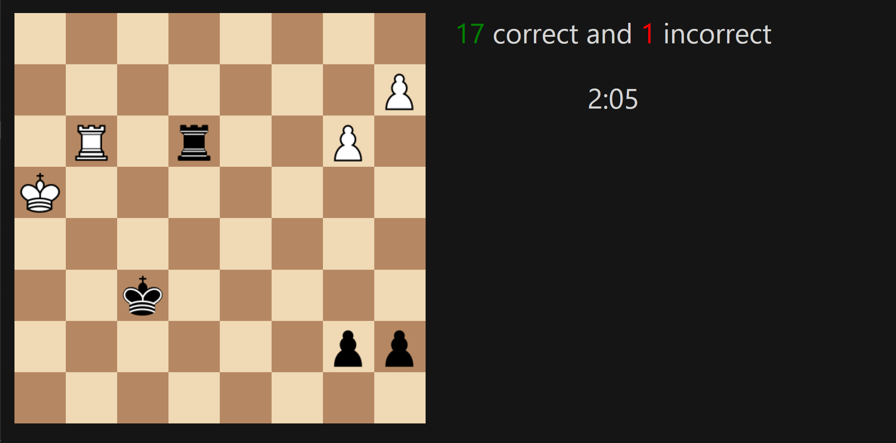

# LiRush

Use an Open Source Puzzle Rush which even works offline!

[Download LiRush](https://www.github.com/r2dev2/LiRush/releases/latest)



## Feedback and Contributing

If you are interested in helping us solve any issues and/or add features, please let us know in [discussions](https://www.github.com/r2dev2/LiRush/discussions) and submit a Pull Request!

## Usage

To build the executable from scratch, execute the following commands in a bash terminal. The resulting folder with the executable will be in dist/LiRush.

```
git clone https://github.com/r2dev2/LiRush.git
cd LiRush
make build
```

To run without building an executable, execute the following commands in a bash terminal.

```
git clone https://github.com/r2dev2/LiRush.git
cd LiRush
make
python3 -m uvicorn server:app --port=42069
```

### ⚠ Build Dependencies ⚠

	- npm
	- python 3.8 or later

## Developers

LiRush was developed by [Ronak Badhe](https://www.github.com/r2dev2).
